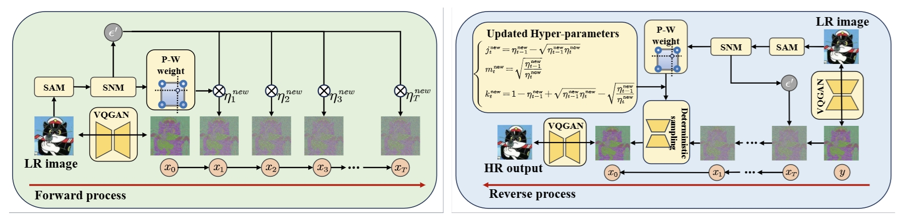

# [IJCAI 2025] Semantic-Guided Diffusion Model for Single-Step Image Super-Resolution

Welcome! This is the official implementation of the paper "[Semantic-Guided Diffusion Model for Single-Step Image Super-Resolution](https://arxiv.org/pdf/2505.07071.pdf)".
  


## Requirements
* Python 3.10, Pytorch 2.1.2

```
conda env create -n SamSR python=3.10
conda activate SamSR
pip install -r requirements.txt
```

## Quickly use our SAM noise Module in your super resolution model

```
sam_model = load_sam_model()            
with th.no_grad():
  masks_tensor = generate_masks_from_batch(sam_model, z_y,)
  noise_weighted = generate_weighted_noise(masks_tensor)
  sam_noise = normalize_noise_to_unit_variance(noise_weighted)
```


## Fast Testing
```sh
python3 inference.py -i [image folder/image path] -o [result folder] --ckpt weights/SamSR_v1.pth --scale 4 --one_step
```

# Requirements
## Reproducing the results in the paper
Download the necessary models. You can download them into the files of [weights](./weights/) from the link below:
+ [SamSR_v1](https://huggingface.co/zh-liu799/SAMSR/resolve/main/SamSR_v1.pth)
+ [SamSR_v2](https://huggingface.co/zh-liu799/SAMSR/resolve/main/SamSR_v2.pth)
+ [sam_vit_b](https://dl.fbaipublicfiles.com/segment_anything/sam_vit_b_01ec64.pth)

### Results in Table 1

- Real data for image super-resolution: [RealSet65](testdata/RealSet65) | [RealSR](testdata/RealSR)
- Test the model
```sh
# Results on RealSet65
python inference.py -i testdata/RealSet65 -o results/SamSR/RealSet65 --scale 4 --ckpt weights/SamSR_v1.pth --one_step

# Results on RealSR
python inference.py -i testdata/RealSet65 -o results/SamSR/RealSR --scale 4 --ckpt weights/SamSR_v1.pth --one_step
```
If you are running on a GPU with limited memory, you could reduce the patch size by setting ```--chop_size 256``` to avoid out of memory. However, this will slightly degrade the performance.
```sh
# Results on RealSet65
python inference.py -i testdata/RealSet65 -o results/SamSR/RealSet65 --scale 4 --ckpt weights/SamSR_v1.pth --one_step --chop_size 256 --task SamSR

# Results on RealSR
python inference.py -i testdata/RealSR -o results/SamSR/RealSR --scale 4 --ckpt weights/SamSR_v1.pth --one_step --chop_size 256 --task SamSR
```

### Results in Table 2
- Download the image ImageNet-Test [(Link)](https://drive.google.com/file/d/1NhmpON2dB2LjManfX6uIj8Pj_Jx6N-6l/view?usp=sharing) to the [testdata](testdata) folder.
- Unzip the downloaded dataset.
- Test the model
```sh
python inference.py -i testdata/imagenet256/lq/ -o results/SamSR/imagenet  -r testdata/imagenet256/gt/ --scale 4 --ckpt weights/SamSR_v2.pth --one_step
```

## Training
### Preparing stage
1. Download the necessary models. You can download them into the files of [weights](./weights/) from the link below:
    + [ResShift](https://github.com/zsyOAOA/ResShift/releases/download/v2.0/resshift_realsrx4_s15_v1.pth)
    + [Autoencoder](https://github.com/zsyOAOA/ResShift/releases/download/v2.0/autoencoder_vq_f4.pth)
2. Adjust the data path in the config file. Specifically, correct and complete paths in files of [traindata](./traindata/)
3. Adjust batchsize according your GPUS.
    + configs.train.batch: [training batchsize, validation btatchsize]
    + configs.train.microbatch: total batchsize = microbatch * #GPUS * num_grad_accumulation

```sh
python3 main_distill.py --cfg_path configs/SamSR.yaml --save_dir logs/SamSR
```

## Acknowledgement

This project is based on [ResShift](https://github.com/zsyOAOA/ResShift) and [SinSR](https://github.com/wyf0912/SinSR/).

## Citation
Please cite our paper if you find our work useful. Thanks! 
```
@article{liu2025semantic,
  title={Semantic-guided diffusion model for single-step image super-resolution},
  author={Liu, Zihang and Zhang, Zhenyu and Tang, Hao},
  journal={arXiv preprint arXiv:2505.07071},
  year={2025}
}
```

## :email: Contact
If you have any questions, please feel free to contact me via `liuzihang@bit.edu.cn`.

